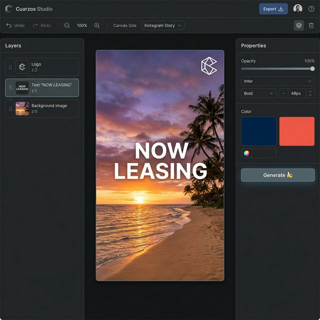
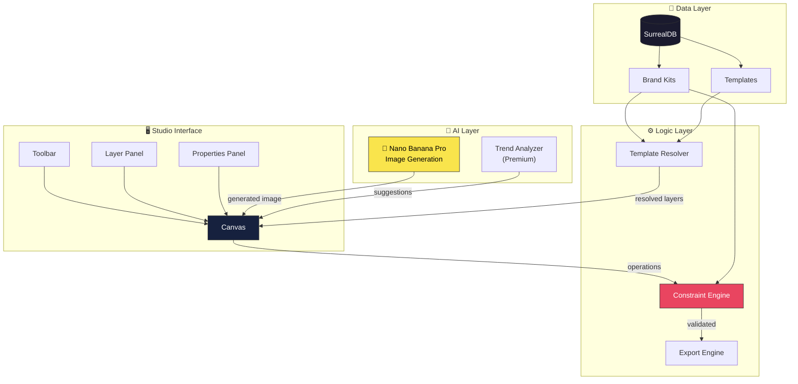
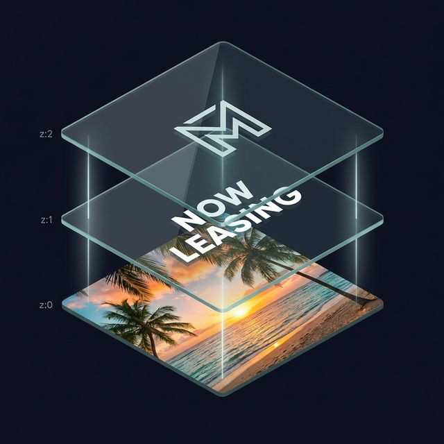
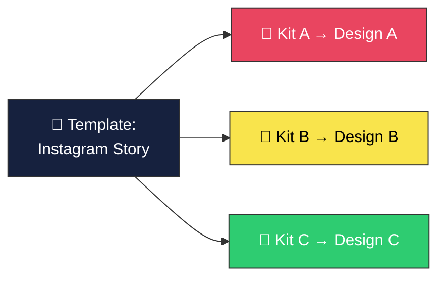
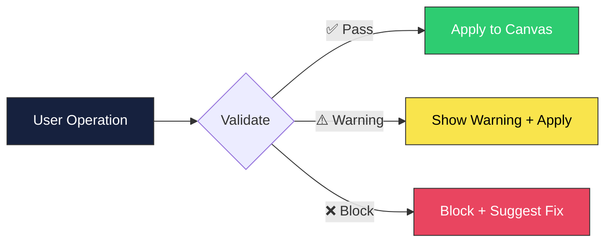
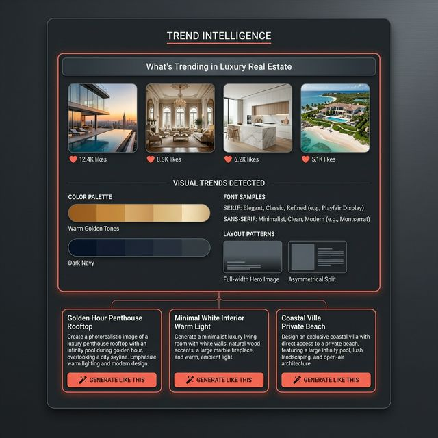
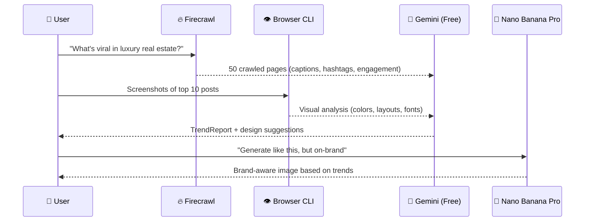

<div align="center">

# 🎨 Cuarzos Studio

**AI-powered brand design tool.**
Generate backgrounds. Overlay brand assets. Export composites.

*The AI generates. The engine assembles. The brand kit constrains.*

[](.)
[](.)
[](.)
[](.)
[](.)
[](.)

</div>

---

## 💡 What Is This?

Cuarzos Studio is a **brand-aware design tool** that combines AI image generation with a layer-based compositor. Think Canva meets Figma, powered by Google's Nano Banana Pro model — with a constraint engine that ensures every output respects your brand.

<div align="center">

</div>

> **You type a prompt.** The AI generates the background. Your logo overlays on top. Brand fonts and colors auto-apply. Export a pixel-perfect branded image in one click. No design skills needed.

---

## 🏗 Architecture



---

## 🧱 Layer Stack

The design surface is a z-ordered stack of three node types:

<div align="center">

</div>

| Node Type | Source | AI-Generated? | Constrained? |
|-----------|--------|:-------------:|:------------:|
| **ImageNode** | Nano Banana Pro | ✅ Yes | Palette-aware prompts |
| **AssetNode** | Brand kit SVG/PNG | ❌ Never | Min size, z-order locked |
| **TextNode** | User input | ❌ No | Fonts, colors from kit |

---

## 🎨 Brand Kit System

Brand kits are **machine-readable constraint files** — not style guide PDFs.

```json
{
  "name": "J. Charles Assets",
  "palette": {
    "primary": "#1a1a2e",
    "accent":  "#e94560",
    "text":    "#eaeaea"
  },
  "fonts": {
    "heading": { "family": "Inter", "weights": [600, 700] },
    "body":    { "family": "Inter", "weights": [400, 500] }
  },
  "logos": [
    { "id": "primary", "file": "logos/primary.svg", "minSize": 80 }
  ],
  "rules": {
    "logoAlwaysOnTop": true,
    "colorMode": "suggest",
    "clearSpaceRatio": 0.25
  }
}
```

**One template × many brand kits = infinite branded content.**



---

## ⚙️ Constraint Engine

Every operation validates against the brand kit in real time:



| Rule | What It Catches | Severity |
|------|----------------|----------|
| `logo-always-on-top` | Logo dragged behind AI image | 🔴 Error |
| `logo-min-size` | Logo shrunk below 80px | 🔴 Error |
| `strict-palette` | Off-brand color picked | 🔴 Error |
| `brand-fonts` | Non-kit font selected | 🟡 Warning |
| `generated-behind-brand` | AI image z-index too high | 🟡 Warning |
| `locked-layer` | Locked layer deletion attempted | 🔴 Error |

---

## 🔥 Premium: Trend Intelligence

> **Free tier:** you tell the AI what to make.
> **Premium tier:** the AI tells YOU what to make — based on what's working.

<div align="center">

</div>



| Tier | Price | What You Get |
|------|-------|-------------|
| **Free** | $0/mo | Studio + templates + AI generation (unlimited) |
| **Pro** | $29/mo | + 10 trend scans/month + smart suggestions |
| **Agency** | $99/mo | + unlimited scans + Meta Pixel + conversion loop |

---

## 🛠 Tech Stack

Already integrated in the Cuarzos runtime:

| Dependency | Version | Role |
|-----------|---------|------|
| [`@xyflow/react`](https://reactflow.dev) | 12.10.0 | Canvas — pan, zoom, drag, z-order |
| [`shadcn/ui`](https://ui.shadcn.com) | new-york | UI chrome — 20+ components mapped |
| [`@google/generative-ai`](https://ai.google.dev) | 0.24.1 | Nano Banana Pro image gen |
| [`next`](https://nextjs.org) | 16.1.1 | Framework |
| [`react`](https://react.dev) | 19.2.3 | UI |
| [`@supabase/supabase-js`](https://supabase.com) | 2.90.1 | Backend |
| [`recharts`](https://recharts.org) | 3.6.0 | Analytics/data viz |

**AI Compute:** All free. Nano Banana Pro via Antigravity OAuth + AI Studio free tier. Trend analysis on dedicated Gemini swarm nodes. Zero API costs for core features.

---

## 📂 Documentation

| File | What It Covers |
|------|---------------|
| [`README.md`](README.md) | This file — architecture overview |
| [`data-model.ts`](data-model.ts) | Layer, BrandKit, Project TypeScript types |
| [`constraint-engine.ts`](constraint-engine.ts) | Brand validation rules + prompt enrichment |
| [`export-engine.ts`](export-engine.ts) | Layer compositor / flatten to image |
| [`generation-pipeline.ts`](generation-pipeline.ts) | Nano Banana Pro integration + style presets |
| [`api-route.ts`](api-route.ts) | Next.js API route for image generation |
| [`component-architecture.md`](component-architecture.md) | React component tree + shadcn mapping |
| [`brand-kit-format.md`](brand-kit-format.md) | kit.json spec + file structure |
| [`template-system.md`](template-system.md) | Template format + resolution + categories |
| [`multi-brand.md`](multi-brand.md) | Kit switching + multi-client workflows |
| [`trend-intelligence.md`](trend-intelligence.md) | Premium feature + pricing model |

---

## 🎯 Design Principles

1. **AI generates, engine assembles** — AI creates raw materials, deterministic code composites them
2. **Brand kit constrains** — every operation validates against machine-readable brand rules
3. **Sacred assets stay sacred** — logos are overlaid, never regenerated by AI
4. **Right tool for the right job** — image gen models for images, constraint logic for rules
5. **Free compute for brains, paid only for data** — premium tier charges for crawling, not reasoning

---

## 🗺 Roadmap

- [x] Architecture specification
- [x] Data model + type system
- [x] Constraint engine design
- [x] Export/flatten pipeline
- [x] Generation pipeline (Nano Banana Pro)
- [x] Component architecture (shadcn + React Flow)
- [x] Brand kit format + multi-brand
- [x] Template system
- [x] Trend intelligence (premium feature)
- [ ] Implementation: Studio page + components
- [ ] Implementation: Brand kit CRUD
- [ ] Implementation: Template library
- [ ] Implementation: Nano Banana Pro API integration
- [ ] Implementation: Firecrawl + Browser CLI integration
- [ ] Launch: Beta with J. Charles Assets brand kit

---

<div align="center">

**Part of the Lensmen Stack** · Built with 🎸 punk rock engineering

*€20/mo Hetzner VPS. Free AI compute. Embarrassing abundance of riches.*

</div>
